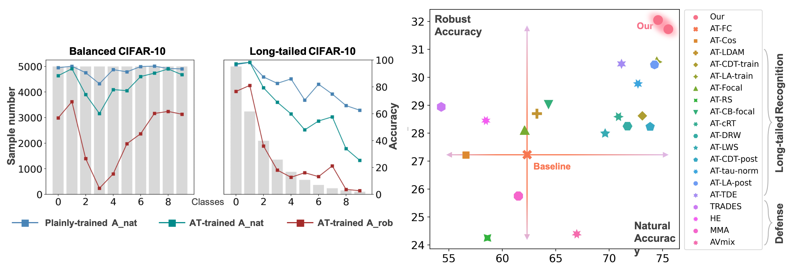

# Adversarial Long-Tail

This repository contains the PyTorch implementation of the [paper](): 

*Adversarial Robustness under Long-Tailed Distribution, CVPR 2021 **(Oral)***
 
[Tong Wu](https://github.com/wutong16), [Ziwei Liu](https://liuziwei7.github.io/), [Qingqiu Huang](http://qqhuang.cn/), [Yu Wang](http://nicsefc.ee.tsinghua.edu.cn/people/yu-wang/), [Dahua Lin](http://dahua.me/)



> Real-world data usually exhibits a long-tailed distribution, while previous works on adversarial robustness mainly focus on balanced datasets.
To push adversarial robustness towards more realistic scenarios, in this work, we investigate the adversarial vulnerability as well as defense under long-tailed distributions.
We perform a systematic study on existing Long-Tailed recognition (LT) methods in conjunction with the Adversarial Training framework (AT) and obtain several valuable observations.
We then propose a clean yet effective framework, RoBal, which consists of two dedicated modules, a scale-invariant classifier and data re-balancing via both margin engineering at the training stage and boundary adjustment during inference.

This repository includes:
- Code for the LT methods applied with AT framework in our study.
- Code and pre-trained models for our method.


## Environment 
* [PyTorch](https://pytorch.org/) (tested on 1.6.0)
* [mmcv](https://github.com/open-mmlab/mmcv)
* [AutoAttack](https://github.com/fra31/auto-attack)
* Other dependencies partially listed in `requirements.txt` 

## Datasets
We use the CIFAR-10-LT and CIFAR-100-LT datasets. The data will be automatically downloaded and converted.

## Usage
### Baseline
To train and evaluate a baseline model, run the following commands:
```
# Vanilla FC for CIFAR-10-LT
python train.py configs/CIFAR10_LT/cifar10_LT0.02_pgdat.yaml
python test.py configs/CIFAR10_LT/cifar10_LT0.02_pgdat.yaml -a ALL

# Vanilla FC for CIFAR-100-LT
python train.py configs/CIFAR100_LT/cifar100_LT0.1_pgdat.yaml
python test.py configs/CIFAR100_LT/cifar100_LT0.1_pgdat.yaml -a ALL
```
Here `-a ALL` denotes that we evaluate five attacks including FGSM, PGD, MIM, CW, and AutoAttack.

### Long-tailed recognition methods with adversarial training framework

We provide scripts for the long-tailed recognition methods applied with adversarial training framework as reported in our study.
We mainly provide config files for CIFAR-10-LT. For CIFAR-100-LT, simply set `imbalance_ratio=0.1`, `dataset=CIFAR100`, and `num_classes=100` in the config file, and don't forget to change the `model_dir` (working directory to save the log files and checkpoints) and `model_path` (checkpoint to evaluate by `test.py`).

#### Methods applied at training time.
> Methods applied at training stage include class-aware re-sampling and different kinds of cost-sensitive learning. 

Train the models with the corresponding config files:
```
# Vanilla Cos
python train.py configs/CIFAR10_LT/cifar10_LT0.02_pgdat_cos.yaml

# Class-aware margin
python train.py configs/CIFAR10_LT/cifar10_LT0.02_pgdat_outer_LDAM.yaml

# Cosine with margin
python train.py configs/CIFAR10_LT/cifar10_LT0.02_pgdat_cos_HE.yaml

# Class-aware temperature
python train.py configs/CIFAR10_LT/cifar10_LT0.02_pgdat_outer_CDT.yaml

# Class-aware bias
python train.py configs/CIFAR10_LT/cifar10_LT0.02_pgdat_outer_logitadjust.yaml

# Hard-exmaple mining
python train.py configs/CIFAR10_LT/cifar10_LT0.02_pgdat_outer_focal.yaml

# Re-sampling
python train.py configs/CIFAR10_LT/cifar10_LT0.02_pgdat_rs-whole.yaml

# Re-weighting (based on effective number of samples)
python train.py configs/CIFAR10_LT/cifar10_LT0.02_pgdat_outer_CB.yaml
```

Evaluate the models with the same config files as training time:
```
python test.py <the-config-file-used-for-training>.yaml -a ALL
```


#### Methods applied via fine-tuning.
> Fine-tuning based methods propose to re-train or fine-tune the classifier via data re-balancing techniques with the backbone frozen.

Train a [baseline model](#baseline) first, and then set the `load_model` in the following config files as `<folder-name-of-the-baseline-model>/epoch80.pt` (path to the last-epoch checkpoint; we have already aligned the settings of directories in this repo). Run fine-tuning by: 
```
# One-epoch re-sampling
python train.py configs/CIFAR10_LT/cifar10_LT0.02_pgdat_rs-fine.yaml

# One-epoch re-weighting
python train.py configs/CIFAR10_LT/cifar10_LT0.02_pgdat_rw-fine.yaml 

# Learnable classifier scale
python train.py configs/CIFAR10_LT/cifar10_LT0.02_pgdat_lws.yaml 
```

Evaluate the models with the same config files as training time:
```
python test.py <the-config-file-used-for-training>.yaml -a ALL
```


#### Methods applied at inference time.
> Methods applied at the inference stage based on a vanilla trained model would usually conduct
  a different forwarding process from the training stage to
  address shifted data distributions from train-set to test-set.

Similarly, train a [baseline model](#baseline) first, and this time set the `model_path` in the following config files as `<folder-name-of-the-baseline-model>/epoch80.pt` (path to the last-epoch checkpoint; we have already aligned the settings of directories in this repo). Run evaluation with a certain inference-time strategy by:
```
# Classifier re-scaling
python test.py configs/CIFAR10_LT/cifar10_LT0.02_pgdat_post_CDT.yaml -a ALL

# Classifier normalization
python test.py configs/CIFAR10_LT/cifar10_LT0.02_pgdat_post_norm.yaml -a ALL

# Class-aware bias
python test.py configs/CIFAR10_LT/cifar10_LT0.02_pgdat_post_logitadjust.yaml -a ALL
```
Sometimes a baseline model is not applicable, since a cosine classifier is used with some statistics recorded during training. For example, to apply the method below, train the model by:
```
# Feature disentangling
python train.py configs/CIFAR10_LT/cifar10_LT0.02_pgdat_TDESim.yaml 
```
Change the `posthoc` setting in the config file as `True`, and evaluate the model by:
```
python test.py configs/CIFAR10_LT/cifar10_LT0.02_pgdat_TDESim.yaml -a ALL
```
***Attention:*** methods that involve *loss temperatures* or *classifier scaling operations* could be at the risk of producing *unexpectedly higher robustness accuracy* for *PGD* and *MIM* attacks, which is NOT reliable as analyzed in Sec.3.3 of our paper. This phenomenon sometimes could be observed at validation time during training. As a result, for a more reliable evaluation, it is essential to keep a similar level of logit scales during both training and inference stage.

### Our method
The config files used for training and inference stage could be different, denoted by `<config-prefix>_train.yaml` and `<config-prefix>_eval.yaml`, respectively. 

#### Training stage
Train the models by running:
```
# CIFAR-10-LT
python train.py configs/CIFAR10_LT/cifar10_LT0.02_pgdat_robal_N_train.yaml
python train.py configs/CIFAR10_LT/cifar10_LT0.02_pgdat_robal_R_train.yaml

# CIFAR-100-LT
python train.py configs/CIFAR100_LT/cifar100_LT0.1_pgdat_robal_N_train.yaml
python train.py configs/CIFAR100_LT/cifar100_LT0.1_pgdat_robal_R_train.yaml
```
***Attention:*** notice that by the end of the training stage, the evaluation results with the original training config file would miss the re-balancing strategy applied at inference state, thus we should change to the evaluation config file to complete the process.
#### Inference stage
Evaluate the models by running:
```
# CIFAR-10-LT
python test.py configs/CIFAR10_LT/cifar10_LT0.02_pgdat_robal_N_eval.yaml -a ALL
python test.py configs/CIFAR10_LT/cifar10_LT0.02_pgdat_robal_R_eval.yaml -a ALL

# CIFAR-100-LT
python test.py configs/CIFAR100_LT/cifar100_LT0.1_pgdat_robal_N_eval.yaml -a ALL
python test.py configs/CIFAR100_LT/cifar100_LT0.1_pgdat_robal_R_eval.yaml -a ALL
```

#### Pre-trained models
We provide the [pre-trained models](https://drive.google.com/drive/folders/1gOsY10_FbTSfwc3xa_utnSL00OCcJb7Q?usp=sharing) for our methods above.
Download and extract them to the `./checkpoints` directory, and produce the results with `eval.yaml` in the corresponding folders by running:
```
python test.py checkpoints/<folder-name-of-the-pretrained-model>/eval.yaml -a ALL
```


## License and Citation
If you find our code or paper useful, please cite our paper:
```bibtex
@inproceedings{wu2021advlt,
 author =  {Tong Wu, Ziwei Liu, Qingqiu Huang, Yu Wang, and Dahua Lin},
 title = {Adversarial Robustness under Long-Tailed Distribution},
 booktitle = {Proceedings of the IEEE Conference on Computer Vision and Pattern Recognition (CVPR)},
 year = {2021}
 }
```
## Acknowledgement
We thank the authors for the following repositories for code reference:
[TRADES](https://github.com/yaodongyu/TRADES), 
[AutoAttack](https://github.com/fra31/auto-attack), 
[ADT](https://github.com/dongyp13/Adversarial-Distributional-Training), 
[Class-Balanced Loss](https://github.com/richardaecn/class-balanced-loss), 
[LDAM-DRW](https://github.com/kaidic/LDAM-DRW), 
[OLTR](https://github.com/zhmiao/OpenLongTailRecognition-OLTR), 
[AT-HE](https://github.com/ShawnXYang/AT_HE), 
[Classifier-Balancing](https://github.com/facebookresearch/classifier-balancing), 
[mma_training](https://github.com/BorealisAI/mma_training), 
[TDE](https://github.com/KaihuaTang/Long-Tailed-Recognition.pytorch), etc.

## Contact
Please contact [@wutong16](https://github.com/wutong16) for questions, comments and reporting bugs.
